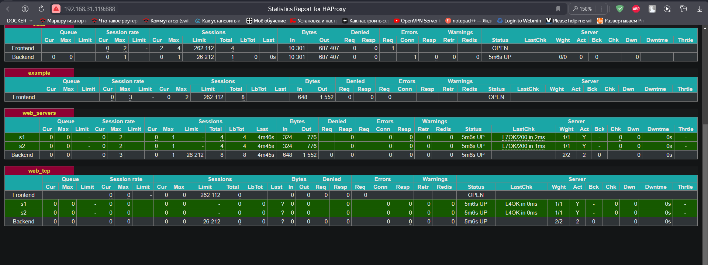
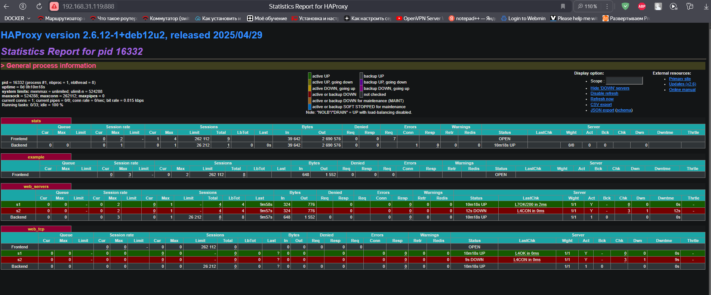

# NGINX


1. Создаем директории 

`` mkdir http1 http2 ``
2. Создаем index.html

```
echo "SERVER 1:8888" > http1/index.html
echo "SERVER 2:9999" > http2/index.html
```
3. Запускаем простой web - сервер 
```
cd http1
python3 -m http.server 8888 --bind 0.0.0.0

# В дугом окне
cd http2
python3 -m http.server 9999 --bind 0.0.0.0
```

 ### Тестируем (в 3м окне):

``curl localhost:8888``
получаем ``SERVER 1:8888``

``curl localhost:9999``
получаем ``SERVER 2:9999``


4. Установим NGINX
``` sudo apt install nginx ```

доподнительные расширения

``sudo apt install nginx-extras``

посмотрим что в конфиге  
`` cat /etc/nginx/nginx.conf ``

ищем строку include /etc/nginx/sites-enabled/*;
чтобы изменить конфиг
``sudo nano /etc/nginx/sites-enabled/default``
проверка конфига

``nginx -t`` 

стартуем 
```systemctl start nginx```

проверяем
``curl localhost``


5. Создадим конфиг и настроим upstream

```
sudo echo "include /etc/nginx/include/upstream.inc;
server {
   listen       80;
   server_name  example-http.com;
   access_log   /var/log/nginx/example-http.com-acess.log;
   error_log    /var/log/nginx/example-http.com-error.log;
   location / {
                proxy_pass      http://example_app;

   }
}" > example-http.conf
```
копируем куда надо 

``sudo cp example-http.conf /etc/nginx/conf.d/``


создаем 
``mkdir -p /etc/nginx/include/``

Создадим файл upstream.inc

```
echo "upstream example_app {

        server 127.0.0.1:8888 weight=3;   # Больший вес указываем на основной сервер
        server 127.0.0.1:9999;

}" > upstream.inc
```

копируем
``sudo cp upstream.inc /etc/nginx/include/upstream.inc``

проверим 
``sudo nginx -t``

применяем конфиг
```
systemctl reload nginx
```
Проверяем
```
curl -H 'Host: example-http.com' http://localhost
```


Чтобы настроить баланисировку на 4 уровне 

```
echo "stream {
        include /etc/nginx/include/upstream.inc;
        server  {
                listen 8080;

                error_log       /var/log/nginx/example-tcp-error.log;
                proxy_pass      example_app;
        }
}" >> /etc/nginx/nginx.conf
```


# HAPROXY
Установим
```sudo apt install haproxy```
Дополним коннфиг

```
echo "listen stats  # веб-страница со статистикой
        bind                    :888
        mode                    http
        stats                   enable
        stats uri               /stats
        stats refresh           5s
        stats realm             Haproxy\ Statistics

frontend example  # секция фронтенд
        mode http
        bind :8088
        #default_backend web_servers
	acl ACL_example.com hdr(host) -i example.com
	use_backend web_servers if ACL_example.com

backend web_servers    # секция бэкенд
        mode http
        balance roundrobin
        option httpchk
        http-check send meth GET uri /index.html
        server s1 127.0.0.1:8888 check
        server s2 127.0.0.1:9999 check


listen web_tcp

	bind :1325

	server s1 127.0.0.1:8888 check inter 3s
	server s2 127.0.0.1:9999 check inter 3s" >>  /etc/haproxy/haproxy.cfg

```
 
 Раскоментируем
 ``#default_backend web_servers``


Перегужаем

```
systemctl reload haproxy
```


посмотрим статистику 




теперь можем отключить один сервер и проверить 


## Настроим HAPROXY+NGINX

Закоментируем чтобы другие запросы не принимались
 ``#default_backend web_servers``

```systemctl reload haproxy.service```

проверим 
``curl 127.0.0.1:8088``


проверим с указанием хоста
`` curl  -H 'Host:example-http.com' http://127.0.0.1:8088``


## TCP балансировка на 4м уровне
раскоментируем блок:

Новый блок


## настроим nginx+haproxy
поменяем секцию в файле 
``` nano /etc/nginx/conf.d/example-http.conf```


```systemctl reload nginx.service```
Проверим без порта, как указано в конфиге
`` curl  -H 'Host:example-http.com' http://127.0.0.1``


